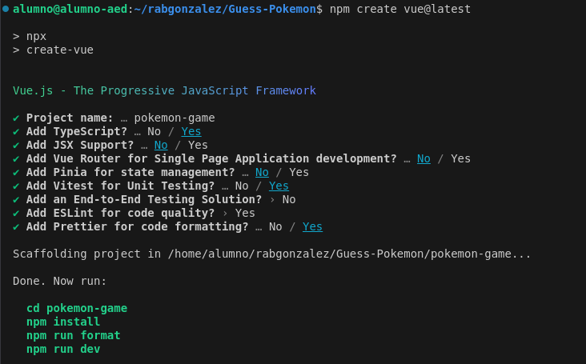
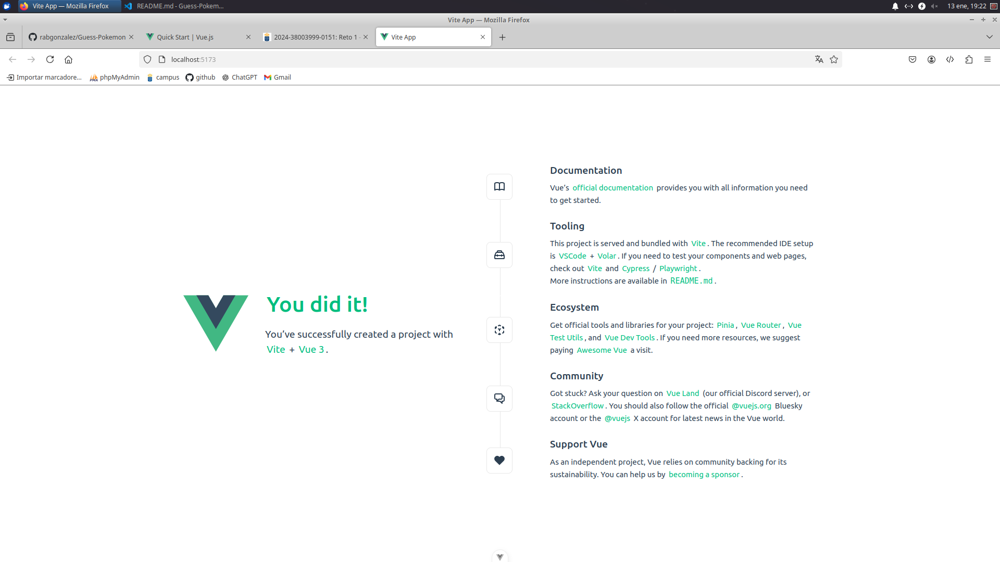

# Guess the Pokemon
# Rubén Abreu González


# Indice
- [Guess the Pokemon](#guess-the-pokemon)
- [Rubén Abreu González](#rubén-abreu-gonzález)
- [Indice](#indice)
  - [Paso 1: Introducción](#paso-1-introducción)
    - [Definiciones](#definiciones)
  - [Paso 2: Verificación de la aplicación](#paso-2-verificación-de-la-aplicación)
    - [Composition API y Screaming Architecture](#composition-api-y-screaming-architecture)
      - [Diferencias Composition API y Option API](#diferencias-composition-api-y-option-api)
      - [Screaming Architecture](#screaming-architecture)

## Paso 1: Introducción
> npm create vue@latest

 

### Definiciones

- Vue Router

Vue Router es una herramienta que permite la conexión de componentes por medio del enrutado del navegador.

- Pinia

Pinia es una librería para Vue que permite compartir información entre componentes.

- Vitest

Vitest es un sistema de testing que permite realizar pruebas y verificar nuestro código de manera cómoda y intuitiva.

- ESLint

Eslint es una herramienta que verifica la calidad de código y aporta recomendaciones para realizar código limpio. 

- Prettier
  
Prettier es una herramienta que asegura una buena estructurazión y una organización de código limpia y cómoda a la vista.

## Paso 2: Verificación de la aplicación
> npm run format
```bash
> pokemon-game@0.0.0 format
> prettier --write src/

src/App.vue 116ms (unchanged)
src/assets/base.css 17ms (unchanged)
src/assets/main.css 5ms (unchanged)
src/components/__tests__/HelloWorld.spec.ts 18ms (unchanged)
src/components/HelloWorld.vue 47ms (unchanged)
src/components/icons/IconCommunity.vue 6ms (unchanged)
src/components/icons/IconDocumentation.vue 5ms (unchanged)
src/components/icons/IconEcosystem.vue 4ms (unchanged)
src/components/icons/IconSupport.vue 2ms (unchanged)
src/components/icons/IconTooling.vue 6ms (unchanged)
src/components/TheWelcome.vue 30ms (unchanged)
src/components/WelcomeItem.vue 12ms (unchanged)
src/main.ts 4ms (unchanged)
```

> npm run dev



### Composition API y Screaming Architecture
#### Diferencias Composition API y Option API


#### Screaming Architecture