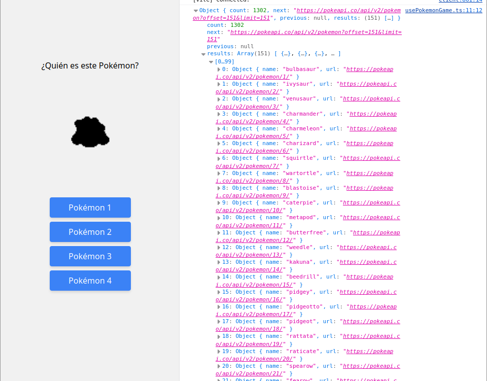
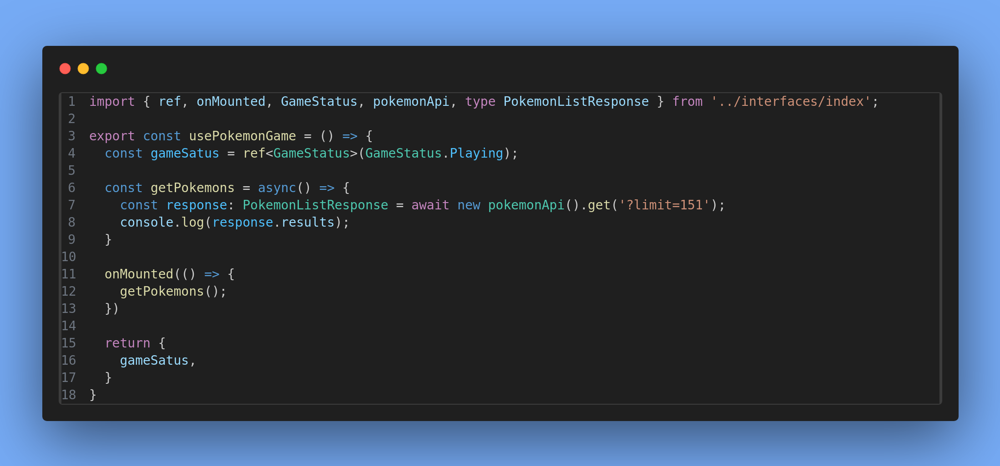

# Guess the Pokemon
# Rubén Abreu González


# Indice
- [Guess the Pokemon](#guess-the-pokemon)
- [Rubén Abreu González](#rubén-abreu-gonzález)
- [Indice](#indice)
- [Reto 1](#reto-1)
  - [Paso 1: Introducción](#paso-1-introducción)
    - [Definiciones](#definiciones)
      - [Vue Router](#vue-router)
      - [Pinia](#pinia)
      - [Vitest](#vitest)
      - [ESLint](#eslint)
      - [Prettier](#prettier)
  - [Paso 2: Verificación de la aplicación](#paso-2-verificación-de-la-aplicación)
    - [Composition API y Screaming Architecture](#composition-api-y-screaming-architecture)
      - [Diferencias Composition API y Option API](#diferencias-composition-api-y-option-api)
      - [Screaming Architecture](#screaming-architecture)
  - [Paso 3: eliminar elementos en desuso](#paso-3-eliminar-elementos-en-desuso)
    - [App.vue](#appvue)
    - [Eliminamos los archivos Assets/base.css y Assets/logo.svg](#eliminamos-los-archivos-assetsbasecss-y-assetslogosvg)
    - [Renombramos el archivo Assets/main.css \> Assets/styles.css](#renombramos-el-archivo-assetsmaincss--assetsstylescss)
    - [Resultado](#resultado)
- [Reto 2](#reto-2)
  - [Estructuración del proyecto](#estructuración-del-proyecto)
  - [Creamos nuestro primer componente](#creamos-nuestro-primer-componente)
    - [PokemonGame.vue](#pokemongamevue)
  - [Preguntas](#preguntas)
    - [¿Para qué sirven las clases que hemos añadido?](#para-qué-sirven-las-clases-que-hemos-añadido)
    - [Saca una captura de como se ve actualmente nuestra aplicación. ¿No ves los cambios? Algo se te olvida... ¿qué es? Indica los archivos que has tenido que modificar.](#saca-una-captura-de-como-se-ve-actualmente-nuestra-aplicación-no-ves-los-cambios-algo-se-te-olvida-qué-es-indica-los-archivos-que-has-tenido-que-modificar)
  - [Ocultar una sección con directivas](#ocultar-una-sección-con-directivas)
    - [Resultado](#resultado-1)
    - [Pokemon Picture y Pokemon Options](#pokemon-picture-y-pokemon-options)
      - [¿para qué crees que sirven?](#para-qué-crees-que-sirven)
    - [Resultado](#resultado-2)
- [Reto 3](#reto-3)
  - [PokemonPicture](#pokemonpicture)
    - [Estilos](#estilos)
  - [PokemonOptions](#pokemonoptions)
    - [Estilos](#estilos-1)
  - [Resultado](#resultado-3)
- [Reto 4](#reto-4)
  - [Animation.css](#animationcss)
  - [game-status.enum.ts](#game-statusenumts)
  - [index.ts](#indexts)
    - [¿Qué es un archivo de barril y cuáles son sus ventajas?](#qué-es-un-archivo-de-barril-y-cuáles-son-sus-ventajas)
  - [usePokemonGame.ts](#usepokemongamets)
    - [¿Qué es lo que estamos haciendo con el código hasta ahora?](#qué-es-lo-que-estamos-haciendo-con-el-código-hasta-ahora)
  - [Axios](#axios)
    - [¿Qué es Axios? ¿Lo has usado antes?](#qué-es-axios-lo-has-usado-antes)
  - [pokemonApi.ts](#pokemonapits)
  - [usePokemonGame.ts](#usepokemongamets-1)
  - [Resultado](#resultado-4)
  - [Postman](#postman)
    - [pokemon-list.response.ts](#pokemon-listresponsets)
  - [usePokemonGame.ts](#usepokemongamets-2)
  - [Resultado](#resultado-5)
- [Reto 5](#reto-5)
  - [pokemon.interface.ts](#pokemoninterfacets)
  - [getPokemons](#getpokemons)
    - [¿Qué es lo que estamos haciendo?](#qué-es-lo-que-estamos-haciendo)
    - [¿Para qué sirve la línea de código: const id = urlParts\[urlParts.length - 2\] ?? 0;?](#para-qué-sirve-la-línea-de-código-const-id--urlpartsurlpartslength---2--0)
  - [usePokemons.ts](#usepokemonsts)
    - [devolver la lista desordenada](#devolver-la-lista-desordenada)

# Reto 1
## Paso 1: Introducción
> npm create vue@latest

 

### Definiciones

#### Vue Router
Vue Router es una herramienta que permite la conexión de componentes por medio del enrutado del navegador.

#### Pinia
Pinia es una librería para Vue que permite compartir información entre componentes.

#### Vitest
Vitest es un sistema de testing que permite realizar pruebas y verificar nuestro código de manera cómoda y intuitiva.

#### ESLint
Eslint es una herramienta que verifica la calidad de código y aporta recomendaciones para realizar código limpio. 

#### Prettier
Prettier es una herramienta que asegura una buena estructurazión y una organización de código limpia y cómoda a la vista.

## Paso 2: Verificación de la aplicación
> npm run format
```bash
> pokemon-game@0.0.0 format
> prettier --write src/

src/App.vue 116ms (unchanged)
src/assets/base.css 17ms (unchanged)
src/assets/main.css 5ms (unchanged)
src/components/__tests__/HelloWorld.spec.ts 18ms (unchanged)
src/components/HelloWorld.vue 47ms (unchanged)
src/components/icons/IconCommunity.vue 6ms (unchanged)
src/components/icons/IconDocumentation.vue 5ms (unchanged)
src/components/icons/IconEcosystem.vue 4ms (unchanged)
src/components/icons/IconSupport.vue 2ms (unchanged)
src/components/icons/IconTooling.vue 6ms (unchanged)
src/components/TheWelcome.vue 30ms (unchanged)
src/components/WelcomeItem.vue 12ms (unchanged)
src/main.ts 4ms (unchanged)
```

> npm run dev


### Composition API y Screaming Architecture
#### Diferencias Composition API y Option API
Composition API y Option API consisten en una forma de organizar los componentes de Vue.
- **Option API** es más antigua, sencilla y directa, ya que cuenta con menos opciones y es todo más automático.
- Sin embargo, **Composition API** es más complejo, pudiendo personalizarlo mejor y siendo más eficiente al escalarlo.

#### Screaming Architecture
Screaming architecture consiste en un concepto en el que la arquitectura del proyecto define el tipo de proyecto en el que se está trabajando a simple vista.

## Paso 3: eliminar elementos en desuso
### App.vue
- eliminamos todo el código que nos ha generado automáticamente Vue


- añadimos en template **(dónde se mostraran los renders de nuestros componentes)** un título con el texto *Hola mundo!*

> [!NOTE]
> Para indicarle a Vue que vamos a utilizar TS en lugar de JS, se lo indicamos en el **lang** de la etiqueta script **(dónde estará la lógica del componente)**

```ts
<script setup lang="ts"></script>

<template>
  <h1>Hola mundo</h1>
</template>

<style scoped></style>
```

### Eliminamos los archivos Assets/base.css y Assets/logo.svg


### Renombramos el archivo Assets/main.css > Assets/styles.css


```ts
import './assets/styles.css'
```

### Resultado


---
# Reto 2
## Estructuración del proyecto


## Creamos nuestro primer componente
### PokemonGame.vue
En este componente generamos la estructura por medio de la extensión de Visual Studio **Vue VSCode Snippet**
> vbase-3-ts-setup
```ts
<template>
  <div>

  </div>
</template>

<script setup lang="ts"></script>

<style lang="scss" scoped></style>
```

## Preguntas
### ¿Para qué sirven las clases que hemos añadido?
- **Template:** es lo que se renderiza de nuestra aplicacion, todo los elementos visuales
- **Script:** es la parte lógica de la aplicación, contiene los métodos, variables, imports...
- **Style:** es el apartado de los estilos, mejora la estructura y la visualización d e los elemtntos.

### Saca una captura de como se ve actualmente nuestra aplicación. ¿No ves los cambios? Algo se te olvida... ¿qué es? Indica los archivos que has tenido que modificar.
Los cambios no se muestran ya que no estamos cargando el componente en App.vue. Tenemos  que importar el Componente que acabamos de crear en la etiqueta **script**
```ts
<script setup lang="ts">
import PokemonGame from './modules/pokemon/views/PokemonGame.vue'
</script>
```

Y en la etiqueta **template** cargar el Componente *PokemonGame*
```ts
<template>
  <PokemonGame />
</template>
```

Ahora accedemos a la url http://localhost:5173/ y vemos el resultado


## Ocultar una sección con directivas
Para ocultar la sección, utilizaremos la directiva **v-show**
> [!NOTE]
> v-show es una directiva que solo renderiza la etiqueta y sus subgrupos si la condición es verdadera.

Para esto, crearemos en la etiqueta **script** una variable que estará inicializada en **false**
```ts
<script setup lang="ts">
import { ref } from 'vue'

const show = ref(false);
</script>
```

Por último, en la etiqueta **section** añadimos la directiva v-show, de modo que solo se mostrará si la variable show es verdadera.
```ts
  <section class="flex flex-col justify-center items-center w-screen h-screen" v-show="show">
```

### Resultado
Efectivamente, la etiqueta section no se mostrará ya que la variable show es falsa


### Pokemon Picture y Pokemon Options
Creamos los componentes *Pokemon Picture* y *Pokemon Options* y los añadimos al componente principal **PokemonGame** 
```ts
<template>
  <section class="flex flex-col justify-center items-center w-screen h-screen" v-show="show">
    <h1 class="text-3xl">Espere por favor</h1>
    <h3 class="animate-pulse">Cargando Pokémons</h3>
  </section>
  <section class="flex flex-col justify-center items-center w-screen h-screen">
    <h1>¿Quién es este Pokémon?</h1>
    <PokemonPicture />
    <PokemonOptions />
  </section>
</template>

<script setup lang="ts">
import { ref } from 'vue'
import PokemonOptions from '../views/PokemonOptions.vue'
import PokemonPicture from '../views/PokemonPicture.vue'
const show = ref(false)
</script>

<style lang="css" scoped></style>
```

#### ¿para qué crees que sirven?
Lo más probable es que:
- En Pokemon Picture almacenemos las imágenes de los pokemons: las siluetas y la imagen al revelarlo
- En Pokemon Options mostremos las posibles opciones para adivinar al pokémon por si silueta

### Resultado


# Reto 3
## PokemonPicture
En *PokemonPicture* mostraremos una imagen de Ditto para marcar el diseño que tendrá nuestro programa
```tsx
<template>
  
</template>
```


### Estilos
Le aplicamos los estilos de Tailwind 
- **brightness-0** (bajamos el brillo a 0 para mostrar la silueta)
- **h-[200px]** (indicamos el tamaño de la imagen)
```tsx
class="brightness-0 h-[200px]"
```


## PokemonOptions
En el template de *PokemonOptions* Creamos una lista de opciones donde irán los nombres de los posibles Pokémons
```tsx
<template>
  <ul>
    <li>Pokémon 1</li>
    <li>Pokémon 2</li>
    <li>Pokémon 3</li>
    <li>Pokémon 4</li>
  </ul>
</template>
```

### Estilos
Aplicamos estilos a la lista.
Para ello, ponemos @apply dentro de las etiquetas css y escribimos los estilos de tailwind.
```tsx
<template>
  <ul>
    <li class="btn btn-blue">Pokémon 1</li>
    <li class="btn btn-blue">Pokémon 2</li>
    <li class="btn btn-blue">Pokémon 3</li>
    <li class="btn btn-blue">Pokémon 4</li>
  </ul>
</template>

<script setup lang="ts"></script>

<style lang="css" scoped>
.btn {
    @apply py-2 px-4 my-2 rounded;
  }
  .btn-blue {
    @apply bg-blue-500 text-white;
  }
  .btn-blue:hover {
    @apply bg-blue-700;
  }
</style>
```

## Resultado


# Reto 4
## Animation.css
Añadimos el archivo *animation.css* a src/assets/


## game-status.enum.ts


## index.ts
```ts
export * from './game-status.enum';
```

### ¿Qué es un archivo de barril y cuáles son sus ventajas?
Es un archivo para almacenar todos los imports

## usePokemonGame.ts


### ¿Qué es lo que estamos haciendo con el código hasta ahora?
Hemos creado un enum con los posibles estados de una partida y hemos creado una variable reactiva para almacenar el estado de la partida actual.

## Axios
### ¿Qué es Axios? ¿Lo has usado antes?
Axios es una librería para facilitar las comunicacion entre la aplicación y la API por medio de solicitudes HTTP

> npm install axios

```bash
added 9 packages, and audited 281 packages in 3s

37 packages are looking for funding
run `npm fund` for details

19 vulnerabilities (9 moderate, 7 high, 3 critical)

To address issues that do not require attention, run:
npm audit fix

To address all issues (including breaking changes), run:
npm audit fix --force

Run `npm audit` for details.
```

## pokemonApi.ts


## usePokemonGame.ts


## Resultado


## Postman


### pokemon-list.response.ts
> Control+P

> JSON to TS: Convert from fromClipboard


## usePokemonGame.ts


## Resultado


# Reto 5
## pokemon.interface.ts
Creamos una interfaz para definir la estructura de datos que queremos almacenar de los pokemon.
```tsx
export interface Pokemon {
  id: number;
  name: string;
}
```

## getPokemons


### ¿Qué es lo que estamos haciendo? 
Modificamos el método de getPokemons() para que nos devuelva un array de los pokemons siguiendo la estructura antes creada **{ id: number, name: string }**

### ¿Para qué sirve la línea de código: const id = urlParts[urlParts.length - 2] ?? 0;?
Estamos obteniendo el id del pokemon de la url que nos proporciona la API.

con el método **.split('/')** estamos dividiendo la url del pokemon en cada **/** y insertando los elementos en un array, por lo que  tendremos que obtener la posición del array en la que se encuentre el id.

La estructura de la url es la siguiente: "https://pokeapi.co/api/v2/pokemon/1/". Por lo que si la seperamos por **/** nos quedaría un array así:

**[ "https:", "", "pokeapi.co", "api", "v2", "pokemon", "1", "" ]**

La posición del id ("1") en el array es la 6 (los arrays empiezan or la posición 0), y al hacer urlParts.length nos devolverá 8, por lo que para obtener la id irémos a la posición urlParts[urlParts.length - 2]

Las interrogaciones **??** sirven para indicar que devolver en caso de que lo que busquemos no exista, por lo que si no hubiera un elemento en la posición 6 de urlParts devolvería 0.

## usePokemons.ts
```tsx
onMounted(async() => {
    const pokemons = await getPokemons();

    console.log({pokemons});
})
```


### devolver la lista desordenada
Para desordenar la lista, usamos el método sort *(compara los elementos de 2 en 2, si el valor es positivo, sustituye el primer elemento por el segundo)*

Para hacer que sea aleatorio, el valor que comprueba el sort es un número aleatorio del -0.5 al 0.5, por lo que si sale algún número mayor que 0 se intercambian la posición.
```tsx
pokemonArray.sort(() => Math.random() - 0.5);
```
