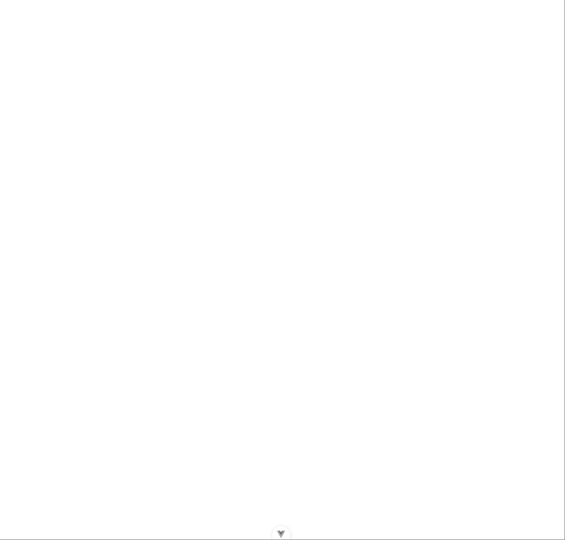

# Guess the Pokemon
# Rubén Abreu González


# Indice
- [Guess the Pokemon](#guess-the-pokemon)
- [Rubén Abreu González](#rubén-abreu-gonzález)
- [Indice](#indice)
- [Reto 1](#reto-1)
  - [Paso 1: Introducción](#paso-1-introducción)
    - [Definiciones](#definiciones)
      - [Vue Router](#vue-router)
      - [Pinia](#pinia)
      - [Vitest](#vitest)
      - [ESLint](#eslint)
      - [Prettier](#prettier)
  - [Paso 2: Verificación de la aplicación](#paso-2-verificación-de-la-aplicación)
    - [Composition API y Screaming Architecture](#composition-api-y-screaming-architecture)
      - [Diferencias Composition API y Option API](#diferencias-composition-api-y-option-api)
      - [Screaming Architecture](#screaming-architecture)
  - [Paso 3: eliminar elementos en desuso](#paso-3-eliminar-elementos-en-desuso)
    - [App.vue](#appvue)
    - [Eliminamos los archivos Assets/base.css y Assets/logo.svg](#eliminamos-los-archivos-assetsbasecss-y-assetslogosvg)
    - [Renombramos el archivo Assets/main.css \> Assets/styles.css](#renombramos-el-archivo-assetsmaincss--assetsstylescss)
      - [Resultado](#resultado)
- [Reto 2](#reto-2)
    - [Estructuración del proyecto](#estructuración-del-proyecto)
    - [Creamos nuestro primer componente](#creamos-nuestro-primer-componente)
      - [PokemonGame.vue](#pokemongamevue)
    - [Preguntas](#preguntas)
      - [¿Para qué sirven las clases que hemos añadido?](#para-qué-sirven-las-clases-que-hemos-añadido)
      - [Saca una captura de como se ve actualmente nuestra aplicación. ¿No ves los cambios? Algo se te olvida... ¿qué es? Indica los archivos que has tenido que modificar.](#saca-una-captura-de-como-se-ve-actualmente-nuestra-aplicación-no-ves-los-cambios-algo-se-te-olvida-qué-es-indica-los-archivos-que-has-tenido-que-modificar)
    - [Ocultar una sección con directivas](#ocultar-una-sección-con-directivas)
      - [Resultado](#resultado-1)
    - [Pokemon Picture y Pokemon Options](#pokemon-picture-y-pokemon-options)
      - [¿para qué crees que sirven?](#para-qué-crees-que-sirven)
      - [Resultado](#resultado-2)

# Reto 1
## Paso 1: Introducción
> npm create vue@latest

 

### Definiciones

#### Vue Router
Vue Router es una herramienta que permite la conexión de componentes por medio del enrutado del navegador.

#### Pinia
Pinia es una librería para Vue que permite compartir información entre componentes.

#### Vitest
Vitest es un sistema de testing que permite realizar pruebas y verificar nuestro código de manera cómoda y intuitiva.

#### ESLint
Eslint es una herramienta que verifica la calidad de código y aporta recomendaciones para realizar código limpio. 

#### Prettier
Prettier es una herramienta que asegura una buena estructurazión y una organización de código limpia y cómoda a la vista.

## Paso 2: Verificación de la aplicación
> npm run format
```bash
> pokemon-game@0.0.0 format
> prettier --write src/

src/App.vue 116ms (unchanged)
src/assets/base.css 17ms (unchanged)
src/assets/main.css 5ms (unchanged)
src/components/__tests__/HelloWorld.spec.ts 18ms (unchanged)
src/components/HelloWorld.vue 47ms (unchanged)
src/components/icons/IconCommunity.vue 6ms (unchanged)
src/components/icons/IconDocumentation.vue 5ms (unchanged)
src/components/icons/IconEcosystem.vue 4ms (unchanged)
src/components/icons/IconSupport.vue 2ms (unchanged)
src/components/icons/IconTooling.vue 6ms (unchanged)
src/components/TheWelcome.vue 30ms (unchanged)
src/components/WelcomeItem.vue 12ms (unchanged)
src/main.ts 4ms (unchanged)
```

> npm run dev


### Composition API y Screaming Architecture
#### Diferencias Composition API y Option API
Composition API y Option API consisten en una forma de organizar los componentes de Vue.
- **Option API** es más antigua, sencilla y directa, ya que cuenta con menos opciones y es todo más automático.
- Sin embargo, **Composition API** es más complejo, pudiendo personalizarlo mejor y siendo más eficiente al escalarlo.

#### Screaming Architecture
Screaming architecture consiste en un concepto en el que la arquitectura del proyecto define el tipo de proyecto en el que se está trabajando a simple vista.

## Paso 3: eliminar elementos en desuso
### App.vue
- eliminamos todo el código que nos ha generado automáticamente Vue


- añadimos en template **(dónde se mostraran los renders de nuestros componentes)** un título con el texto *Hola mundo!*

> [!NOTE]
> Para indicarle a Vue que vamos a utilizar TS en lugar de JS, se lo indicamos en el **lang** de la etiqueta script **(dónde estará la lógica del componente)**

```ts
<script setup lang="ts"></script>

<template>
  <h1>Hola mundo</h1>
</template>

<style scoped></style>
```

### Eliminamos los archivos Assets/base.css y Assets/logo.svg


### Renombramos el archivo Assets/main.css > Assets/styles.css


```ts
import './assets/styles.css'
```

#### Resultado


---
# Reto 2
### Estructuración del proyecto


### Creamos nuestro primer componente
#### PokemonGame.vue
En este componente generamos la estructura por medio de la extensión de Visual Studio **Vue VSCode Snippet**
> vbase-3
```ts
<template>
  <div>

  </div>
</template>

<script>
export default {
  setup () {
    

    return {}
  }
}
</script>

<style lang="scss" scoped>

</style>
```

### Preguntas
#### ¿Para qué sirven las clases que hemos añadido?
Buena pregunta

#### Saca una captura de como se ve actualmente nuestra aplicación. ¿No ves los cambios? Algo se te olvida... ¿qué es? Indica los archivos que has tenido que modificar.
Los cambios no se muestran ya que no estamos cargando el componente en App.vue. Tenemos  que importar el Componente que acabamos de crear en la etiqueta **script**
```ts
<script lang="ts">
import PokemonGame from './modules/pokemon/views/PokemonGame.vue'

export default {
  components: {
    PokemonGame,
  },
}
</script>
```

Y en la etiqueta **template** cargar el Componente *PokemonGame*
```ts
<template>
  <PokemonGame />
</template>
```

Ahora accedemos a la url http://localhost:5173/ y vemos el resultado


### Ocultar una sección con directivas
Para ocultar la sección, utilizaremos la directiva **v-show**
> [!NOTE]
> v-show es una directiva que solo renderiza la etiqueta y sus subgrupos si la condición es verdadera.

Para esto, crearemos en la etiqueta **script** una variable que estará inicializada en **false**
```ts
<script>
import { ref } from 'vue'

const show = ref(false)

export default {
  setup() {
    return {
      show,
    }
  },
}
</script>
```

Por último, en la etiqueta **section** añadimos la directiva v-show, de modo que solo se mostrará si la variable show es verdadera.
```ts
  <section class="flex flex-col justify-center items-center w-screen h-screen" v-show="show">
```

#### Resultado
Efectivamente, la etiqueta section no se mostrará ya que la variable show es falsa


### Pokemon Picture y Pokemon Options
Creamos los componentes *Pokemon Picture* y *Pokemon Options* y los añadimos al componente principal **PokemonGame** 
```ts
<template>
  <section class="flex flex-col justify-center items-center w-screen h-screen" v-show="show">
    <h1 class="text-3xl">Espere por favor</h1>
    <h3 class="animate-pulse">Cargando Pokémons</h3>
  </section>
  <section class="flex flex-col justify-center items-center w-screen h-screen">
    <h1>¿Quién es este Pokémon?</h1>
    <PokemonPicture />
    <PokemonOptions />
  </section>
</template>

<script>
import { ref } from 'vue'
import PokemonPicture from './PokemonPicture.vue'
import PokemonOptions from './PokemonOptions.vue'

const show = ref(false)

export default {
  setup() {
    return {
      show,
    }
  },

  components: {
    PokemonPicture,
    PokemonOptions,
  },
}
</script>

<style lang="css" scoped></style>
```

#### ¿para qué crees que sirven?
Lo más probable es que:
- En Pokemon Picture almacenemos las imágenes de los pokemons: las siluetas y la imagen al revelarlo
- En Pokemon Options mostremos las posibles opciones para adivinar al pokémon por si silueta

#### Resultado
